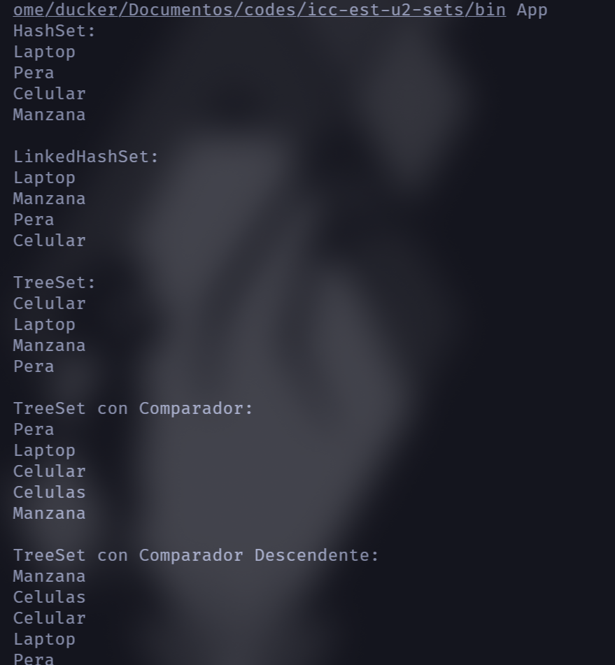

# Práctica Sets

- **Título:** Práctica de Pilas y colas
- **Asignatura:** Estructura de Datos  
- **Carrera:** Computación  
- **Estudiante:** Cristopher Salinas  
- **Fecha:** 1/07/2025  
- **Profesor:** Ing. Pablo Torres  

## Ejemplo de Ejecución

El programa realiza las siguientes acciones:

1. Inserta los nodos: 50, 17, 76, 9, 23, 54, 14, 19.
2. Imprime el peso (tamaño) y altura del árbol.
3. Realiza el recorrido InOrden.
4. Muestra el recorrido InOrden con alturas.
5. Muestra el recorrido InOrden con factores de equilibrio.
6. Verifica si el árbol está balanceado.
7. Busca un nodo específico.
8. Inserta un nodo adicional si ex

# 📦 Sets en Java - Implementación de HashSet, LinkedHashSet y TreeSet

Este proyecto demuestra el uso de diferentes implementaciones de la interfaz `Set` en Java, incluyendo `HashSet`, `LinkedHashSet` y `TreeSet`, además de comparadores personalizados para ordenar los elementos según distintos criterios.

---

## 📂 Paquete

`controllers.Sets`

---

## 🚀 Funcionalidades

### ✅ `construirHashSet()`
- Usa `HashSet`.
- No mantiene el orden de inserción.
- No permite duplicados.

### ✅ `construirLinkedHashSet()`
- Usa `LinkedHashSet`
- Mantiene el orden de inserción.
- No permite duplicados.

### ✅ `construirTreeSet()`
- Usa `TreeSet`.
- Ordena los elementos en orden natural (alfabético en este caso).
- No permite duplicados.

### ✅ `construirTreeSetConComparador()`
- Usa `TreeSet` con un **comparador personalizado**.
- Ordena las palabras por **longitud ascendente** y alfabéticamente si tienen la misma longitud.

### ✅ `construirTreeSetConComparadorDescendente()`
- Usa `TreeSet` con un **comparador descendente**.
- Ordena las palabras por **longitud descendente** y alfabéticamente en orden inverso si tienen la misma longitud.

---

